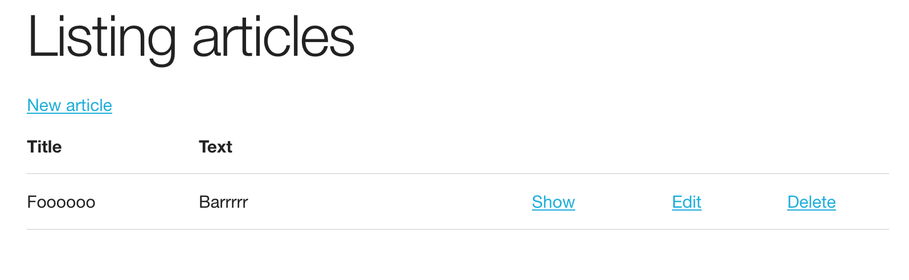

# Hello Ruby on Rails

Following [this tutorial from rubyonrails.org](https://guides.rubyonrails.org/getting_started.html#hello-rails-bang).



```bash
cd blog
bin/rails server
```

Launches a web server.

